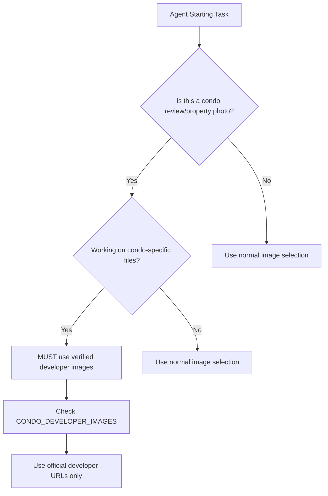

# 🤖 Agent-Specific Image Handling Instructions

## 📍 SCOPE: Only affects specific agents and condo-related components

### ✅ **property-article-writer** Agent

#### When Writing Condo Reviews:
- **MUST USE**: Verified developer images from `CONDO_DEVELOPER_IMAGES`
- **CHECK**: `src/data/condo-developer-images.ts` for approved URLs
- **FORBIDDEN**: Any `images.unsplash.com`, `images.pexels.com`, generic stock photos

```javascript
// CORRECT - Condo Review Article
const condoImages = {
  'grand-dunman': 'https://thegranddunman.sg/wp-content/uploads/2023/07/Grand_Dunamn_Gallery_Img_-1-scaled.jpg',
  'the-continuum': 'https://continuum-condo.sg/wp-content/uploads/2023/03/The_Continuum_Condo_Hero-1536x859.jpg'
}

// WRONG - Stock Photos for Condo Reviews
const wrongImages = {
  'grand-dunman': 'https://images.unsplash.com/photo-1567767292278-a4f21aa2d36e' // ❌ FORBIDDEN
}
```

#### When Writing Market Analysis/Policy Articles:
- **ALLOWED**: Charts, graphs, infographics
- **ALLOWED**: Generic market imagery
- **NO RESTRICTIONS**: Use normal image selection process

```javascript
// CORRECT - Market Analysis Article
const marketImages = {
  'price-chart': 'generated-chart-from-data.png',           // ✅ OK
  'policy-infographic': 'https://images.unsplash.com/...'  // ✅ OK for non-condo content
}
```

---

### ✅ **singapore-property-report-generator** Agent

#### For Property Photos in Reports:
- **MUST USE**: Verified developer images for property sections
- **SOURCE**: `CONDO_DEVELOPER_IMAGES` mapping

#### For Charts/Graphs/Maps:
- **ALLOWED**: Generated charts from data
- **ALLOWED**: Google Maps, location maps
- **ALLOWED**: Generic business graphics

```javascript
// CORRECT - Property Report
const reportContent = {
  propertyPhoto: getVerifiedDeveloperImage('grand-dunman'),  // ✅ Required
  priceChart: generateChartFromData(priceData),             // ✅ OK
  locationMap: 'https://maps.googleapis.com/...',          // ✅ OK
  companyLogo: 'generic-logo.png'                          // ✅ OK
}
```

---

### ❌ **singapore-property-scorer** Agent (EXEMPT)

- **NO IMAGE REQUIREMENTS**: Pure data analysis
- **FOCUS**: Scoring metrics, calculations only
- **STATUS**: Completely exempt from image rules

```javascript
// This agent doesn't handle images at all
const propertyScore = {
  locationScore: 4.2,
  designScore: 4.5,
  investmentScore: 4.1
}
```

---

### ❌ **linkedin-property-content-optimizer** Agent (EXEMPT)

- **USES EXISTING**: References images already in published articles
- **NO DIRECT SELECTION**: Doesn't choose new images
- **ALLOWED**: Suggest crops/highlights from existing content

```javascript
// This agent optimizes existing content
const linkedinPost = {
  text: optimizeForLinkedIn(articleText),
  imageHint: 'Use the main hero image from the article'  // ✅ References existing
}
```

---

## 📁 File-Specific Rules

### ✅ ENFORCED FILES (Developer Images Only):
```
src/lib/condo-data.ts                    ← Condo listing data
src/app/condos/page.tsx                  ← Condo listing page  
src/app/condos/[slug]/page.tsx          ← Individual condo pages
src/components/CondoImageGallery.tsx     ← Image gallery component
src/data/condo-developer-images.ts      ← Developer image sources
```

### ❌ NORMAL FILES (Standard Image Selection):
```
src/app/articles/*                       ← Market analysis articles
src/components/charts/*                  ← Chart components
src/app/news/*                          ← News articles
All other files...                      ← Normal image rules apply
```

---

## 🔄 Quick Decision Flow



---

## ✅ Current Verified Developer Images

### Ready to Use (Already Verified):
- **Grand Dunman**: `thegranddunman.sg/wp-content/uploads/*`
- **The Continuum**: `continuum-condo.sg/wp-content/uploads/*`
- **Lentor Mansion**: `lentor-mansion.com.sg/wp-content/uploads/*`
- **Orchard Sophia**: `orchard-sophia.sg/wp-content/uploads/*`
- **Avenue South Residence**: `avenue-south.sg/wp-content/uploads/*`
- **Normanton Park**: `normanton-park.sg/wp-content/uploads/*`

### For New Condos:
1. Find official developer website
2. Extract marketing image URLs
3. Test URLs for accessibility
4. Add to `CONDO_DEVELOPER_IMAGES`
5. Update `condo-data.ts`

---

**Last Updated**: January 2025  
**Scope**: Targeted enforcement for condo-specific agents and components only